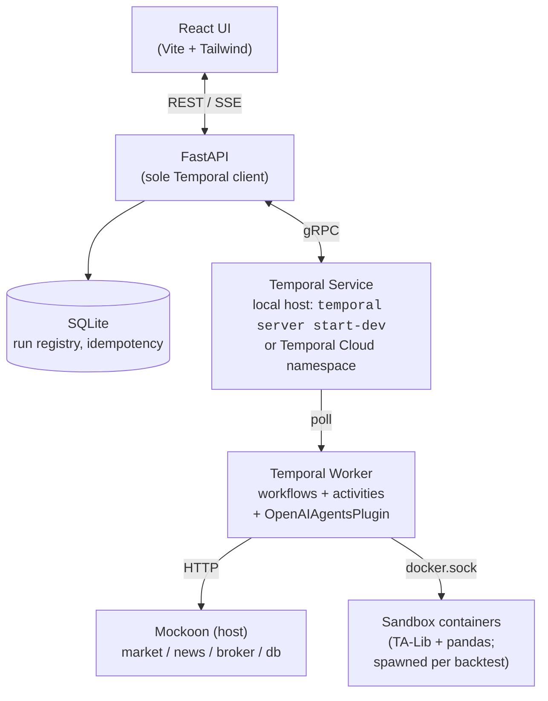

# Temporal: The Durable Operating System for Agentic AI

> Demo to showcase Temporal as the Durable OS layer for Agentic AI underneath an autonomous OpenAI-Agents-SDK trading agent.

An autonomous stock-trading agent that:
1. **Discovers** a strategy by fanning out N parallel sandboxed backtests within airgapped Dockers
2. **Lives** through a tick loop with market + news context, LLM trade-intent (OpenAI Agents SDK), deterministic risk guardrail, and human-in-the-loop approval for big trades
3. **Survives** chaos — kill the worker mid-trade and Temporal replays the agent's decision history to resume from the exact line

Temporal provides the durable OS layer: autosave (workflow state = event history), guardrails (deterministic activities + signals), observability (every LLM call / tool call / signal is a queryable event), and long-lived coordination (workflows pause for approval at zero CPU cost).

📖 **Canonical context for AI/coding agents:** [`AGENTS.md`](AGENTS.md)
🎯 **Locked design spec:** [`docs/superpowers/specs/2026-05-21-self-evolving-stock-agent-design.md`](docs/superpowers/specs/2026-05-21-self-evolving-stock-agent-design.md)
📋 **Implementation plan & history:** [`docs/superpowers/plans/2026-05-21-self-evolving-stock-agent-plan.md`](docs/superpowers/plans/2026-05-21-self-evolving-stock-agent-plan.md)
📚 **Original brainstorm:** [`project_description.md`](project_description.md)

---

## Architecture at a glance



| Layer | Tech |
|---|---|
| Frontend | React 18 + Vite + Tailwind + shadcn primitives + recharts |
| Backend API | FastAPI (sole Temporal client) + SSE event bus |
| Workflows | `temporalio[openai-agents]>=1.17` — durable orchestration |
| LLM | OpenAI Agents SDK (`Agent` + `Runner` + `activity_as_tool`) wired into Temporal via `OpenAIAgentsPlugin` |
| Backtests | Per-strategy deterministic templates, executed in Docker sandboxes (TA-Lib pre-baked) |
| Mocked services | Mockoon Desktop (host) — market, news, broker, domain DB |
| App DB | SQLite (runs registry, idempotency keys, chaos log) |

---

## Prerequisites (one-time host setup)

These run on your Mac/host, not inside Docker. **Compose only contains FastAPI + worker + frontend.**

### 1. Temporal Service — pick one

The FastAPI client and the worker both connect to a Temporal Service. You can point them at a local dev server **or** Temporal Cloud.

#### Option A — Local dev server (default)

Install the Temporal CLI: https://docs.temporal.io/cli — then start it:

```bash
temporal server start-dev --ip 0.0.0.0
```

- gRPC server: `:7233`
- Web UI: `:8233`

> `--ip 0.0.0.0` is required so Docker containers can reach it via `host.docker.internal:7233`. Without it, Temporal binds to `127.0.0.1` only and the worker container will fail with `NetworkUnreachable`.

#### Option B — Temporal Cloud

To point at a Cloud namespace instead, override the address + namespace in `.env`:

```bash
TEMPORAL_ADDRESS=<your-namespace>.<account>.tmprl.cloud:7233
TEMPORAL_NAMESPACE=<your-namespace>.<account>
```

You'll also need to enable TLS + an auth credential on the two `Client.connect(...)` call sites — [`backend/fastapi_app/temporal_client.py`](backend/fastapi_app/temporal_client.py) and [`backend/worker/main.py`](backend/worker/main.py). Either:

- **API key** (simpler): `tls=True, api_key="<your-key>"` — get one from the Cloud UI → API Keys.
- **mTLS cert** (per-namespace): `tls=TLSConfig(client_cert=..., client_private_key=...)` — see [Temporal Cloud mTLS docs](https://docs.temporal.io/cloud/certificates).

Skip the `start-dev` step entirely. The Temporal Web UI link in [`MissionControl.tsx:42`](frontend/src/components/MissionControl.tsx#L42) (which hardcodes `localhost:8233`) won't apply — open your workflow in the Cloud UI instead.

### 2. Mockoon (on host)

Install the Mockoon Desktop app: https://mockoon.com/download/ — then:

1. **File → Open environment** → pick `mockoon/demo.json` from this repo
2. Click ▶ Start (the env binds to `:3001`)

> Make sure Mockoon is bound to all interfaces, not just `127.0.0.1`. In Mockoon Desktop the default is fine. CLI alternative: `mockoon-cli start --data ./mockoon/demo.json --port 3001`.

### 3. Build the sandbox base image (one-time)

The sandbox image is NOT built by compose — it's a per-backtest sibling container, pre-baked with TA-Lib + pandas + pyarrow. Compile is ~5 min the first time:

```bash
docker build -t durable-agent-sandbox:latest sandbox/
```

Verify:
```bash
docker images | grep durable-agent-sandbox
```

### 4. Docker Desktop must be running

Compose builds containers; the worker also spawns sibling sandbox containers via `docker.sock`.

---

## Run the demo

```bash
cp .env.example .env
# Required: set OPENAI_API_KEY=sk-...
# Optional: tune TICK_SECONDS, APPROVAL_THRESHOLD_USD, NUM_SANDBOXES

docker compose up --build
```

Open:
- **Demo UI:** http://localhost:5173
- **Temporal Web UI:** http://localhost:8233 (your host install)
- **FastAPI docs:** http://localhost:8000/docs
- **Mockoon Desktop:** native app

Enter `NVDA`, click **Start Self-Evolving Agent**, watch:
1. War Room — 8 sandboxes spin up, each running a deterministic backtest in a fresh Docker container. Winner glows.
2. Trading Floor — live tick loop every 10s, the OpenAI Agent decides BUY/SELL/HOLD, risk guardrail filters, big trades pop an approval modal.
3. Open the Temporal Web UI in a side tab — show the audience every LLM call as a `StartActivityTask` event in history.

### Stage choreography

See [§9 of the design spec](docs/superpowers/specs/2026-05-21-self-evolving-stock-agent-design.md#9-stage-demo-script-target-1012-min) for the minute-by-minute script. Key moments:

| Time | Chaos action | Audience sees |
|---|---|---|
| ~3:00 | **Inject Bad News** | Next tick: news flips negative, risk_check returns `block`, trade doesn't fire |
| ~4:30 | **Fast Forward** + clean news | Trade intent → BUY → approval modal pops |
| ~6:00 | **Kill Worker** | Agent freezes mid-activity |
| ~6:15 | **Restart Worker** | Open Temporal UI — replay continues from the exact event, activity completes |

---

## Project layout

```
durable-agentic-harness/
├── README.md                                ← you are here
├── AGENTS.md                                ← canonical AI-agent context
├── docker-compose.yml                       ← fastapi + worker + frontend (no Temporal / Mockoon)
├── .env.example
├── docs/superpowers/{specs,plans}/          ← design spec + implementation plan
├── project_description.md                   ← original brainstorm
├── frontend/                                ← Vite + React + shadcn UI
├── backend/
│   ├── pyproject.toml                       ← temporalio[openai-agents], openai-agents
│   ├── Dockerfile.{fastapi,worker}
│   ├── shared/                              ← Pydantic models, prompts, settings
│   ├── fastapi_app/                         ← sole Temporal client + REST + SSE
│   └── worker/
│       ├── main.py                          ← Worker with OpenAIAgentsPlugin
│       ├── workflows/{parent,backtest,hello}.py
│       └── activities/                      ← market, news, broker, risk, persist, ui, backtest
├── mockoon/demo.json                        ← load into Mockoon Desktop on host
└── sandbox/                                 ← TA-Lib + pandas Docker base image
```

---

## How the OpenAI Agents SDK integrates with Temporal

The trade-intent step uses the canonical `temporalio.contrib.openai_agents` pattern from
[temporal-community/openai-agents-demos](https://github.com/temporal-community/openai-agents-demos):

```python
# backend/worker/main.py
client = await Client.connect(
    settings.temporal_address,
    plugins=[OpenAIAgentsPlugin(
        model_params=ModelActivityParameters(
            start_to_close_timeout=timedelta(seconds=60),
            retry_policy=RetryPolicy(initial_interval=timedelta(seconds=1), ...),
        ),
    )],
    ...
)
```

```python
# backend/worker/workflows/parent.py — _run_trade_agent()
agent = Agent(
    name="TradeIntentAgent",
    instructions=LIVE_AGENT_PROMPT,
    tools=[
        temporal_agents.workflow.activity_as_tool(
            fetch_market_snapshot, start_to_close_timeout=timedelta(seconds=30),
        ),
        temporal_agents.workflow.activity_as_tool(
            fetch_news_snapshot, start_to_close_timeout=timedelta(seconds=30),
        ),
    ],
    output_type=TradeIntent,
)
result = await Runner.run(agent, input=input_msg, max_turns=20)
```

**What this gives you for free:**
- Every LLM call the Agent makes is dispatched as a Temporal activity (durable, retryable, in event history)
- Tool invocations route through `fetch_market_snapshot` / `fetch_news_snapshot` activities — also durable
- Worker crash mid-agent-loop: Temporal replays from the last completed event when the worker restarts
- The Agent's structured `output_type=TradeIntent` removes any JSON-parsing fragility

---

## Environment variables

See [`.env.example`](.env.example) for the full list. The important ones:

| Var | Default | Notes |
|---|---|---|
| `OPENAI_API_KEY` | _required_ | Your OpenAI key (used by the Agent's plugin-managed activity) |
| `OPENAI_MODEL` | `gpt-4o-mini` | Bump to `gpt-4o` if the agent struggles with multi-turn reasoning |
| `TEMPORAL_ADDRESS` | `host.docker.internal:7233` | Container-side address for host's Temporal |
| `DATA_MODE` | `mock` | `mock` = all Mockoon; `live` = Yahoo Finance for OHLCV + quotes |
| `TICK_SECONDS` | `10` | Live loop tick interval |
| `APPROVAL_THRESHOLD_USD` | `10000` | Trades above this $ amount require human approval |
| `NUM_SANDBOXES` | `8` | Parallel backtests per Phase 1 |
| `SANDBOX_NETWORK_DISABLED` | `true` | Sandboxes run offline (just file I/O) |
| `FASTAPI_INTERNAL_TOKEN` | `demo-token-change-me` | Shared token for worker→fastapi event POSTs |

---

## Troubleshooting

| Symptom | Fix |
|---|---|
| `worker` exits with `NetworkUnreachable [fdc4:...]` | Temporal isn't bound to all interfaces. Restart with `temporal server start-dev --ip 0.0.0.0`. The compose worker has IPv6 disabled via sysctl, so it forces IPv4 lookup for `host.docker.internal`. |
| `worker` exits with `ModuleNotFoundError: No module named 'worker'` | The FastAPI Dockerfile is missing the `COPY worker/` line. Should already be fixed; rebuild with `docker compose up -d --build fastapi`. |
| `fetch_market_snapshot` returns `Expecting value: line 1 column N` | Mockoon Desktop has an old `demo.json` loaded. Stop + reload the env. Check templates render cleanly with `curl -i http://localhost:3001/market/quote?ticker=NVDA`. |
| `pyarrow` / `parquet` ImportError in worker | Rebuild worker (`docker compose up -d --build worker`) so it picks up the latest `pyproject.toml`. |
| Agents SDK `MaxTurnsExceeded (10)` | Model is looping on tools. Bump `OPENAI_MODEL=gpt-4o` in `.env`, or drop `tools=[...]` from the `Agent(...)` definition in [`parent.py`](backend/worker/workflows/parent.py). |
| `ValueError: no successful backtests` | All 8 sandboxes failed. Check `docker images | grep durable-agent-sandbox` — image must exist. If missing, run `docker build -t durable-agent-sandbox:latest sandbox/`. |
| UI says "no active run" but workflow is running in Temporal Web UI | The auto-attach hook hits `/api/runs/` and re-attaches to the most recent. Hit **Cmd+Shift+R**. Top-right of the header has a ✕ to detach + start fresh. |
| Frontend can't reach FastAPI through proxy | Vite proxy needs FastAPI on `:8000`. SSE bypasses the proxy via `http://localhost:8000` directly (FastAPI CORS allows `:5173`). |

---

## Demo commands cheatsheet

```bash
# Fresh start (rebuild everything; nuke volumes)
docker compose down -v
docker volume rm sandbox-data 2>/dev/null || true
docker compose up --build

# Restart just the worker after code changes
docker compose up -d --build worker

# Watch worker logs (live)
docker compose logs worker -f

# Watch FastAPI logs
docker compose logs fastapi -f

# Terminate a stuck workflow
temporal workflow terminate -w agent-NVDA-XXXXXXXX --reason "manual cleanup"

# Smoke test a Mockoon endpoint
curl -s "http://localhost:3001/market/quote?ticker=NVDA" | jq

# Smoke test FastAPI health
curl -s http://localhost:8000/health | jq

# List recent runs from SQLite
curl -s http://localhost:8000/api/runs/ | jq
```

---

## What's NOT in v1 (deferred)

- **Crash Broker / Restart Broker chaos buttons** — Mockoon runs on the host now (Mockoon Desktop), so the user stops/starts it there directly.
- **LLM-generated backtest code** — for stage reliability, backtests use deterministic templates per strategy family ([`backtest_template.py`](backend/worker/activities/backtest_template.py)). The script is still shown in the War Room UI; the OpenAI call is just skipped at Phase 1.
- **Broker MCP server** — `place_order` activity hits Mockoon directly. MCP gateway is a v2 enhancement.
- **Slack / Telegram approval** — approvals happen in the in-app React modal.

---

## License & credits

Inspiration drawn from:
- [temporal-community/temporal-ai-agent](https://github.com/temporal-community/temporal-ai-agent)
- [temporal-community/openai-agents-demos](https://github.com/temporal-community/openai-agents-demos)
- [Temporal blog: Introducing Temporal and Agentic Sandboxes for the OpenAI Agents SDK](https://temporal.io/blog/introducing-temporal-and-agentic-sandboxes-openai-agents-sdk)
