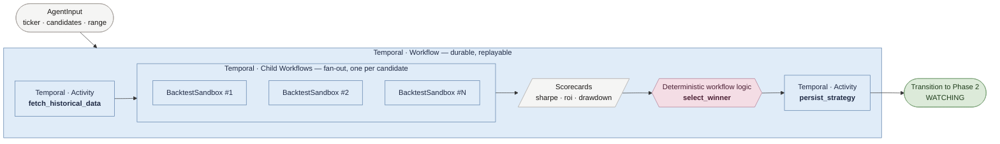

# Phase 1 Architecture — Strategy Discovery

Phase 1 is **pure Temporal** — no LLM, no Agents SDK. The parent workflow fans out N child workflows in parallel, each running a backtest activity in a sandbox. Scorecards come back, the parent deterministically picks a winner, and persists it before Phase 2 begins.

## Legend

| Color | Meaning |
| --- | --- |
| 🟦 Soft blue | **Temporal primitive** (Workflow · Child Workflow · Activity) |
| 🟪 Dusty rose | **Deterministic workflow logic** — runs inside the workflow, replay-safe |
| 🟩 Sage | **Phase transition** |

## Key beats

- **Outer box** — `Temporal · Workflow`. The entire discovery phase is durable; if a worker dies mid-fanout, the workflow replays from event history.
- **`fetch_historical_data`** — `Temporal · Activity`. Side-effectful I/O isolated outside workflow code.
- **`BacktestSandbox` #1…N** — `Temporal · Child Workflows`. One per candidate strategy. A bad strategy can't poison its siblings or the parent.
- **`select_winner`** — plain Python inside the workflow. Deterministic: identical scorecards always produce the same winner, which is what makes replay safe.
- **`persist_strategy`** — `Temporal · Activity`. The winner is written before Phase 2 starts so a restart picks up trading on the right strategy.

Implementation: [backend/worker/workflows/parent.py](../backend/worker/workflows/parent.py) · [backend/worker/workflows/backtest.py](../backend/worker/workflows/backtest.py)
