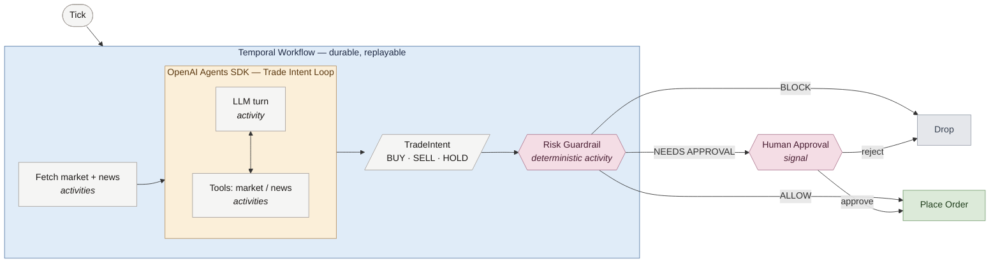

# Phase 2 Architecture — Trade Intent Loop

The OpenAI Agents SDK trade-intent loop runs **inside** a Temporal workflow. Every tick fetches context, runs the agent, applies a deterministic risk guardrail, and either executes the trade, drops it, or gates it on human approval.

## Key beats

- **Outer box** — durable Temporal workflow; everything inside survives worker crashes and replays from history.
- **Inner box** — the OpenAI Agents SDK loop. Each LLM turn and each tool call is dispatched as a Temporal activity via `OpenAIAgentsPlugin` and `activity_as_tool`, so the multi-turn reasoning loop is durable end-to-end.
- **Risk guardrail** — a deterministic, non-LLM activity. The trustworthy gate sitting between the model and the broker.
- **Three exits** — `BLOCK` drops the intent, `ALLOW` places the order, `ALLOW_REQUIRES_APPROVAL` pauses on a human signal before executing or rejecting.

Implementation: [backend/worker/workflows/parent.py](../backend/worker/workflows/parent.py)
