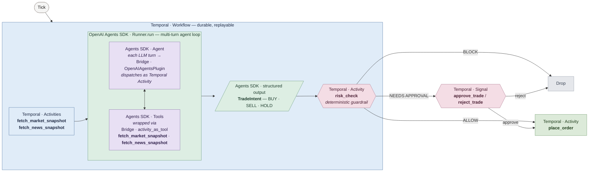

# Phase 2 Architecture — Trade Intent Loop

Phase 2 is where the **OpenAI Agents SDK** runs **inside** a **Temporal Workflow**. Every tick: fetch context, run the agent loop, apply a deterministic risk guardrail, then execute, drop, or gate the trade on a human signal. The bridge between the two SDKs is two primitives — `OpenAIAgentsPlugin` and `activity_as_tool`.

## Legend

| Color | Meaning |
| --- | --- |
| 🟦 Soft blue | **Temporal primitive** (Workflow · Activity · Signal) |
| 🟩 Sage green | **OpenAI Agents SDK primitive** (Agent · Runner · structured output) |
| 🟪 Lavender | **Bridge primitive** — where the two SDKs meet (`OpenAIAgentsPlugin`, `activity_as_tool`) |
| 🌸 Dusty rose | Deterministic gate (risk check, human approval) |
| 🟢 Sage | Success path |
| ⬜ Light gray | Drop / dead-end |

## Key beats

- **Outer shell** — `Temporal · Workflow`. Every signal, every activity, every LLM turn is recorded in history. A worker crash mid-conversation just replays.
- **Inner loop** — `OpenAI Agents SDK · Runner.run`. Plain SDK code: `Agent(...)`, `Runner.run(agent, ...)`, `output_type=TradeIntent`. No Temporal-specific code in the agent definition.
- **Bridge · `OpenAIAgentsPlugin`** — installed on the worker. Transparently dispatches every LLM turn inside `Runner.run` as a `Temporal · Activity`. The multi-turn reasoning loop becomes durable end-to-end.
- **Bridge · `activity_as_tool`** — wraps a `Temporal · Activity` so the Agent sees it as a normal function tool. Tool calls become activity executions in workflow history.
- **`risk_check`** — `Temporal · Activity`, deterministic. The trustworthy guardrail sitting between the model's intent and the broker.
- **Human gate** — `Temporal · Signal` (`approve_trade` / `reject_trade`). The workflow `wait_condition`s on the approval map; a restart resumes the wait, not the LLM call.
- **`place_order`** — `Temporal · Activity` with an idempotency key derived from workflow ID + intent ID, so retries don't double-trade.

Implementation: [backend/worker/workflows/parent.py](../backend/worker/workflows/parent.py)
