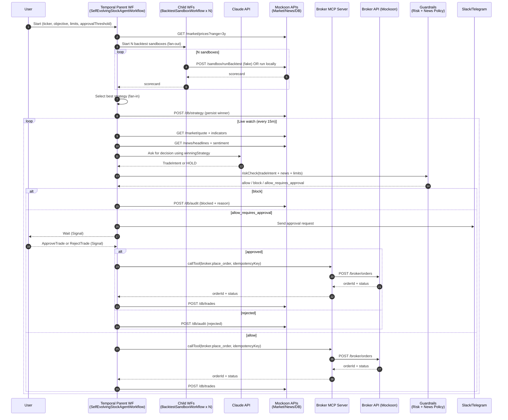
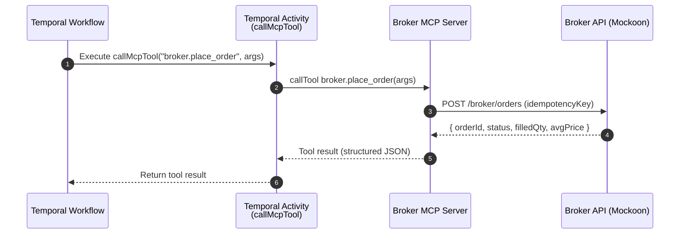

Durable Agent Harness Demo - Durable Agentic OS - Temporal as Agent Harness

# Part 1 - What is an Agent Harness?

An **agent harness** is the operational software infrastructure that wraps around an AI model to transform it into a functional, autonomous agent. 

While the AI model (like GPT-4 or Claude) serves as the "brain" for reasoning, it is naturally stateless and cannot interact with the real world on its own. The harness provides the "body" and "nervous system"—the environment, tools, and memory—required for that brain to actually execute tasks. 

## **Core Functions of a Harness**

- **Tool Execution:** Connects the model to external capabilities like web search, code execution in sandboxed environments, or database queries.
- **Memory & State Persistence:** Manages long-term context by saving snapshots of progress, allowing an agent to "remember" its work across multiple sessions and bypass context window limits.
- **Orchestration Loop:** Runs the "while-loop" that keeps the agent active, enabling it to take an action, observe the result, and decide the next step until the goal is achieved.
- **Guardrails & Safety:** Enforces rules on what actions are allowed, manages human-in-the-loop approvals, and prevents harmful executions.
- **Lifecycle Management:** Handles the "boot sequence," including initializing system prompts and permissions for the agent to start its task.

## **Why It Matters**

A model alone can generate a response but cannot "do" work. The harness is what turns a text generator into a **digital worker**. For example, in Claude Code/Codex, the specialized harness allows the model to search through complex repositories, run terminal commands, and fix bugs autonomously. 

| Component | Analogy | Function |
| --- | --- | --- |
| **AI Model** | The Brain | Reasoning, logic, and intent prediction. |
| **Agent Harness** | The Body/ Nervous System / OS | Tools, memory, Guardrails, and the execution loop. |
| **AI Agent** | The Person | The complete system (Brain + Body + Nervous ssystem) performing a task. |

Using **Temporal** as an agent harness can be considered the gold standard for **production-grade** agentic applications. While frameworks like LangGraph are great for prototyping "reasoning loops," Temporal excels at the "boring but deadly" infrastructure: ensuring an agent doesn't die if a server crashes, a network blips, or an LLM takes 5 minutes to respond.

## **Does Temporal Shine Here? Its the Flight recorder for Agentic AI system**

**Yes.** Temporal is a **durable execution platform**. In an agentic context, it acts as a "flight recorder" that persists every state change. If your agent is mid-task and your infrastructure fails, Temporal restarts it at the exact line of code where it stopped, with all variables intact.

## **Creating a "Durable Agent OS" Structure**

To build this as a reusable "Operating System" for your agents, structure your code like this:

| Layer | Component | How it fits in Temporal |
| --- | --- | --- |
| **User Space** | Chat UI / CLI | Sends a `StartWorkflow` request to Temporal. |
| **Kernel** | **Temporal Server** | The "Durable Substrate" that tracks event history and ensures completion. |
| **Drivers** | **Activities** | Specialized "Tool Connectors" (Search, Database, Payment) with retry policies. |
| **Process** | **Workflows** | The "Agent Harness." It holds the reasoning loop, memory, and state. |

## **Summary of Temporal's Harness Roles**

- **Memory:** Instead of managing a database for chat history, the **Temporal Event History** is your source of truth.
- **Persistence:** "Autosave" for your agent. No matter what breaks, it resumes exactly where it left off.
- **Scalability:** You can run millions of these agents concurrently on a single cluster.

# Durable Smart Self Optimizing Trading Agents (something similar to OpenClaw for trading agents)

 A true **Agentic OS** uses the LLM as the **Reasoning Engine** that decides the strategy, while Temporal provides the **Durable Infrastructure**.

In this "smart" version, the agent doesn't just follow a rule; it **discovers** the rule.

## **The "Self-Optimizing" Trading Agent**

Here is how Temporal acts as the harness for a truly AI-driven strategy:

## **Step 1: Strategy Discovery (The "Brain" Phase)**

Instead of you telling the agent "Use RSI," you give it a goal: *"Find the most profitable strategy for AAPL over the last 3 years."*

- **Temporal Harness Task:** Starts a `BacktestWorkflow`.
- **AI Role:** The LLM uses a tool (Python Interpreter Activity) to pull historical data, runs multiple simulations (MACD, Bollinger Bands, Mean Reversion), and analyzes which one had the best Sharpe Ratio for that specific ticker.
- **Result:** The AI outputs a JSON strategy: `{ "indicator": "EMA_Cross", "params": [12, 26], "confidence": 0.85 }`.

## **Step 2: The Durable Watch (The "Body" Phase)**

The AI has picked the strategy. Now, the Temporal Workflow "morphs" into a monitor for that specific strategy.

- **Temporal Harness Task:** It runs a loop that executes the AI's chosen strategy.
- **AI Role:** Every hour, the harness feeds current market sentiment (news headlines) + technical data to the LLM.
- **The Difference:** The LLM might say, *"The technicals say BUY, but I just read a news report about a supply chain strike in China. Abort the trade."*

## **Step 3: Adaptive Execution (The "OS" Phase)**

If the market conditions change drastically, a traditional system breaks. An Agentic OS adapts.

- **Temporal Harness Task:** It detects "Low Performance." If the strategy starts losing money beyond a threshold, Temporal triggers a **"Re-plan Signal."**
- **AI Role:** The LLM looks at the losses, realizes the "EMA_Cross" isn't working in a sideways market, and **rewrites its own execution logic** for the next cycle.

---

## **Why Temporal is the "Better Recommendation" for this**

You might think, *"Can't I just run a Python script for this?"* You could, but here is why Temporal makes it an **Operating System**:

1. **Long-Term Memory (Context Persistence):** Researching 3 years of data and running multi-day monitors takes time. Temporal ensures that if the AI is 80% through a massive data analysis and the power goes out, it doesn't start from zero. It **resumes** from the last data chunk.
2. **Tool Reliability:** AI agents are notorious for "hallucinating" tool calls or hitting API rate limits. Temporal’s **Activity Retries** act as the "error-handling kernel," ensuring the agent doesn't crash just because Yahoo Finance was down for 2 seconds.
3. **Audit Trail for LLM Decisions:** In finance, you need to know *why* an agent bought a stock. Temporal’s **Event History** stores every LLM prompt and response as a permanent record.

## **A Better Workflow Architecture:**

1. **Researcher Agent (Activity):** LLM analyzes historical data -> Proposes Strategy.
2. **Validation Agent (Activity):** A second LLM "critics" the strategy for risk.
3. **The Harness (Workflow):** Implements the strategy durably.
4. **The Supervisor (Signal):** You, the human, get a summarized report of the "Why" and "How" before clicking "Enable Live Trading."

# Part 5 - Parallel Sandboxes for experimentation

Using **parallel sandboxes** in Step 1 (Strategy Discovery) is an excellent move and is exactly where Temporal’s design as an orchestrator begins to separate itself from simple scripts.

In a "Durable Agent OS," you don't just want one AI researcher; you want a "War Room" of them. Here is how that works using Temporal and sandboxes.

## **1. Why Parallel Sandboxes Make Sense**

To find the best strategy for a stock, your agent needs to run potentially dangerous or resource-heavy code (like complex Python backtests with custom libraries).

- **Security:** Running AI-generated code in a sandbox (like Docker, E2B, or [OpenAI's Sandbox](https://temporal.io/blog/introducing-temporal-and-agentic-sandboxes-openai-agents-sdk)) ensures a "hallucinated" bug or a malicious script cannot crash your main system.
- **Speed (Concurrency):** Instead of testing "Mean Reversion" and then "Trend Following," you can spin up 50 sandboxes simultaneously to test 50 different variations of technical indicators in seconds.
- **Isolation:** Each strategy test gets its own clean environment with its own dependencies, preventing "state bleed" between tests. [1, 2, 3, 4]

## **2. Temporal as the "Sandbox Manager"**

Temporal acts as the **Kernel** that manages these sandboxes. This is a core pattern in high-end agentic systems: [5]

- **Provisioning:** The Temporal Workflow (the Harness) sends a signal to a "Sandbox Service" to provision $N$ isolated environments.
- **Durable Orchestration:** If you are running 100 parallel backtests and 10 of them fail due to a network timeout or a sandbox crash, Temporal automatically retries only those 10, without restarting the other 90 successful ones.
- **Aggregation:** The Workflow waits for all parallel "Promises" to return, then feeds all 100 results back to a "Supervisor LLM" to pick the winner. [6, 7, 8, 9, 10]

## **3. The "Agent OS" Workflow Structure**

This is how you would structure Step 1 as a technologist:

1. **Parent Workflow:** "Strategy Optimizer"
2. **Parallel Branching:** Uses `workflow.start_child_workflow` or `async` activities to launch multiple sub-tasks.
3. **The Sandbox Activity:** Each branch calls an Activity that:
    - Requests a fresh sandbox.
    - Uploads historical stock data.
    - Tells the LLM to write a Python script for a specific strategy.
    - Executes the script and returns the Sharpe Ratio.
4. **The Join:** Once all sandboxes finish, the Parent Workflow summarizes the results. [10, 11, 12]

## **Summary of Fit**

| Task | Why it works |
| --- | --- |
| **Parallelism** | Temporal handles the "fan-out" of hundreds of concurrent tasks easily. |
| **Sandboxing** | Temporal manages the lifecycle (create, use, delete) so you don't leak resources (orphaned sandboxes). |
| **Cost Control** | You can set timeouts on sandboxes via the harness so a runaway AI script doesn't run forever. |

# Part 6 - Final Blueprint - Self Evolving Durable Stock Agent

This is the blueprint for a **Durable Agentic OS** where **Temporal** is the harness (the skeleton and nervous system) and the **LLM** is the brain.

## **The Final Flow: "The Self-Evolving Stock Agent"**

## **Phase 1: Strategy Synthesis (The "War Room")**

1. **Trigger:** User inputs a stock ticker (e.g., `NVDA`) and a goal ("Optimize for 3-month growth").
2. **Fan-Out (Parallel Sandboxes):** The Temporal Workflow initiates a "Fan-out." It triggers 5–10 parallel **Activities**.
3. **Sandbox Execution:** Each Activity spins up an isolated sandbox (e.g., E2B or Docker). Inside each:
    - **LLM 1** writes a Python backtesting script for a specific hypothesis (e.g., "Mean Reversion using Bollinger Bands").
    - The script runs against 3 years of historical data.
    - The sandbox returns a "Performance Scorecard" (ROI, Drawdown, Sharpe Ratio).
4. **The Join:** Temporal waits for all parallel sandboxes to report back.
5. **Selection:** A "Supervisor LLM" reviews the scorecards and picks the winning strategy.

## **Phase 2: Live Deployment (The "Durable Watch")**

1. **Harness Initialization:** Temporal transforms from a "researcher" into a "monitor." It saves the winning strategy parameters into its **Workflow State**.
2. **The Reasoning Loop (Continuous):** The workflow runs an infinite loop (e.g., every 15 minutes):
    - **Activity A:** Fetch real-time price and technicals.
    - **Activity B (The Brain):** LLM analyzes the data + live news sentiment.
    - **Decision:** LLM returns `BUY`, `SELL`, or `HOLD`.
3. **Durable Retries:** If the Broker API is down during a `BUY` signal, Temporal’s harness automatically retries the execution every few seconds until it succeeds. The agent **never "forgets"** to finish a trade.

## **Phase 3: Human-in-the-Loop (The "Guardrail")**

1. **Signal Request:** For any trade over a set $ amount, the Workflow pauses. It sends a message to your phone/Slack.
2. **State Suspension:** The agent is "frozen" in time. It consumes no CPU while waiting for you.
3. **Approval:** You send a **Signal** ("Approve"). Temporal immediately resumes the workflow at the next line of code to execute the trade.

## **Phase 4: Self-Correction (The "Evolution")**

1. **Audit & Re-plan:** Once a week, the Workflow analyzes its own live performance.
2. **Drift Detection:** If the "Live ROI" is 20% lower than the "Backtest ROI," the harness triggers a **Recursive Re-plan**.
3. **Loop Back:** It goes back to **Phase 1** to discover a new strategy better suited for the *current* market regime.

---

## **Why this is a "Technologist's Dream" Harness:**

- **Infrastructure as Code:** The agent's logic is just a Python function, but it has the reliability of a banking system.
- **No Database Needed:** You don't need to manage a "State" database for the agent; Temporal's **Event History** *is* the state.
- **Observability:** You can look at the Temporal Web UI and see exactly what the AI was thinking at 2:00 AM last Tuesday.

# Part 7 - Implementing **Phase 1→4** exactly: Fan-out Sandboxes → Best Strategy → News Guardrails → Approval → Broker Order

This part is the **implementation blueprint** for the exact “Final Flow: *The Self‑Evolving Stock Agent*” from Part 6 — not a simplified loop. The demo is designed to be **repeatable and safe**, using **Mockoon** for fake market/news/broker/DB APIs and **Slack/Telegram** for approval.

## The exact “Final Flow” (Step 1 → Step 6) — and how we implement each step

Below is the **same flow** as Part 6, written as **implementation steps** (what runs in Temporal, what is a child workflow/activity, and what is mocked).

1. **Workflow initialized: “Optimize NVDA for 3-month growth.”**
    - Temporal: start `SelfEvolvingStockAgentWorkflow(ticker, objective, limits, approvalThreshold)`.
    - Workflow state: initialize `goal`, `limits`, `positions`, `auditLog`.
2. **Fan-out: start 5–10 parallel strategy sandboxes.**
    - Temporal: `workflow.startChild(BacktestSandboxWorkflow, …)` for each `strategySpec`.
    - Each sandbox does: fetch historical data (or receives reference) → run backtest → return scorecard.
    - Mockoon: optional `POST /sandbox/runBacktest` to simulate sandbox compute.
3. **Join: wait for all sandboxes and select best strategy.**
    - Temporal: `await Promise.all(childResults)` then deterministic selection in workflow code.
    - Persist: store `winningStrategy` in workflow state and `POST /db/strategy` in Mockoon.
4. **Durable watch: continuously fetch market + news and produce a trade intent.**
    - Temporal: timer-driven loop (e.g., every 15 min) in the parent workflow.
    - Activities (Mockoon): `GET /market/quote`, `GET /market/indicators`, `GET /news/headlines`, `GET /news/sentiment`.
    - LLM (Claude Activity): produces `TradeIntent` or `HOLD` using *winningStrategy + live context*.
5. **Guardrails: news-aware policy can override the LLM.**
    - Temporal Activity `riskCheck(tradeIntent, newsSnapshot, limits, positions)` returns:
        - `block` (stop), or
        - `allow_requires_approval` (continue to step 6), or
        - `allow` (skip approval if you want low-value trades to auto-execute).
    - News guardrail examples:
        - sentiment score below threshold
        - restricted keywords in headlines (“trading halt”, “SEC probe”, “fraud”, “bankruptcy”)
6. **Human approval → broker order → DB write (exactly once).**
    - Notify: Activity sends Slack/Telegram message with trade + news + risk summary.
    - Pause: workflow waits for `ApproveTrade` / `RejectTrade` **Signal**.
    - If approved:
        - Activity `placeOrder(tradeIntent, idempotencyKey)` → `POST /broker/orders` (Mockoon).
        - Activity `writeTradeRecord(orderResult)` → `POST /db/trades`.
    - If rejected: write audit record and return to step 4 loop.

## What the demo should prove (Temporal-specific)

- **Fan-out/Fan-in orchestration:** 5–10 parallel sandboxes run backtests concurrently, then the workflow deterministically joins results.
- **Durable strategy selection:** the “winning” strategy is stored in workflow state and can survive worker crashes.
- **Long-running live monitor:** workflow can run for hours/days with timers, without losing context.
- **Policy + news guardrails:** deterministic checks can block trades even if the LLM wants to trade.
- **Human-in-the-loop approvals:** Signals pause safely for approval (Slack/Telegram) and resume instantly.
- **Exactly-once-ish side effects:** order placement uses idempotency keys and is only performed after approval.

## System components (demo stack)

### Core runtime

1. **Temporal Workflow + Worker**
    - Parent workflow: `SelfEvolvingStockAgentWorkflow`
    - Child workflows (one per sandbox): `BacktestSandboxWorkflow`
2. **OpenAI Agents SDK (SandboxAgent) + Docker sandbox backend**
    - Use the **OpenAI Agents SDK** `SandboxAgent` to execute code, manipulate files, and run shell commands inside a sandbox.
    - Configure the sandbox to run **durably under Temporal** using the Temporal sandbox bridge from the OpenAI Agents SDK sandbox + Temporal extension (the key seam is providing a Temporal-backed sandbox client for the **Docker** backend, e.g. conceptually `temporal_sandbox_client("docker")`).
    - The agent runs backtests inside Docker sandboxes; guardrails + approvals stay deterministic in workflow/activities.
3. **LLM**
    - Claude API (planner + summarizer) for the live loop decisioning (TradeIntent vs HOLD). The LLM can propose actions, but **guardrails decide**.

### Mocked external systems (Mockoon)

- Market data: `GET /market/prices?ticker=...&range=3y` (optional if you don’t want live Yahoo calls during the demo)
- News: `GET /news/headlines?ticker=...` and `GET /news/sentiment?ticker=...`
- Broker (Mockoon): `POST /broker/orders`
- Portfolio/Trades “DB”: `GET /db/positions`, `POST /db/trades`, `POST /db/strategy`

### Spoof MCP server for Broker (backed by Mockoon) — Docker + Temporal

Instead of having the workflow call `POST /broker/orders` directly, we can put a **Broker MCP server** in front of Mockoon. This gives you a stable “tool contract” (`broker.place_order`) that your agent/workflow can call, while keeping the broker fully fake.

#### What you’ll run

- **Mockoon** (fake broker REST API)
- **Broker MCP Server** (tool gateway; calls Mockoon under the hood)
- **Temporal worker** (calls MCP tools from Activities; retryable + durable)

#### MCP tools (minimal)

- `broker.place_order`
    - Input: `{ ticker, side, qty, orderType, limitPrice?, timeInForce?, idempotencyKey }`
    - Output: `{ orderId, status, filledQty, avgPrice, raw }`
- `broker.get_order`
    - Input: `{ orderId }`
    - Output: `{ orderId, status, filledQty, avgPrice, raw }`
- `broker.cancel_order`
    - Input: `{ orderId }`
    - Output: `{ orderId, status, raw }`

#### How the MCP server maps to Mockoon

- `broker.place_order` → `POST http://mockoon:3001/broker/orders`
- `broker.get_order` → `GET  http://mockoon:3001/broker/orders/{orderId}`
- `broker.cancel_order` → `POST http://mockoon:3001/broker/orders/{orderId}/cancel`

#### Temporal integration pattern (recommended)

- Create a Temporal **Activity** `callMcpTool(toolName, args)` that:
    1. calls the MCP server endpoint (or MCP runtime) for `toolName`
    2. returns structured output
- Your parent workflow uses **only**:
    - `callMcpTool("broker.place_order", {...})`
    - and never calls Mockoon directly

This makes broker actions:

- retryable (Activity retry policy)
- time-bounded (timeouts)
- auditable (Event History shows tool calls + results)

#### Docker compose sketch (conceptual)

```yaml
services:
  temporal:
    image: temporalio/auto-setup:latest
    ports: ["7233:7233"]
  temporal-ui:
    image: temporalio/ui:latest
    environment:
      - TEMPORAL_ADDRESS=temporal:7233
    ports: ["8080:8080"]
  mockoon:
    image: mockoon/cli:latest
    command: ["--data", "/data/mockoon.json", "--port", "3001"]
    volumes:
      - ./mockoon.json:/data/mockoon.json
    ports: ["3001:3001"]
  broker-mcp:
    build: ./broker-mcp
    environment:
      - BROKER_BASE_URL=http://mockoon:3001
    ports: ["3333:3333"]
  worker:
    build: ./worker
    environment:
      - TEMPORAL_ADDRESS=temporal:7233
      - BROKER_MCP_URL=http://broker-mcp:3333
```

#### Demo moment to show on stage

1. Place order via `broker.place_order` tool call (MCP → Mockoon)
2. Kill the worker right after the Activity starts
3. Restart worker → Temporal retries/resumes → tool call completes
4. Event History shows the durable tool invocation + returned orderId

### Real market data + backtesting libraries (for the “real” version of the demo)

- **Yahoo market data** (prices/quotes): used by the backtest sandboxes and/or the live loop to fetch real OHLCV.
    - Practical note: you can still keep Mockoon as a fallback to make the demo deterministic if rate limits/network fail.
- **TA-Lib** ([ta-lib.org](http://ta-lib.org)) for technical indicators in backtests (RSI, MACD, Bollinger Bands, EMAs, etc.).
    - Recommended approach: bake TA-Lib into the Docker sandbox image (or install once into the sandbox on session creation) so each backtest run is fast and repeatable.

### Messaging

- Slack/Telegram notifications (Activity that calls your message API or Slack bot)
- Temporal **Signals** for approval: `ApproveTrade`, `RejectTrade`

## Phase-by-phase workflow design (maps 1:1 to Part 6)

## Phase 1 — Strategy Synthesis (The “War Room” fan-out sandboxes)

**Goal:** Given `ticker` + `objective` (“Optimize for 3-month growth”), run parallel backtests and pick the best strategy.

### Inputs

- `ticker` (e.g., NVDA)
- `objective` (e.g., “maximize Sharpe”, “maximize ROI with max drawdown < 10%”)
- `historyRange` (e.g., 3y)
- `numSandboxes` (e.g., 10)
- `candidateStrategies` (e.g., Bollinger, EMA cross, mean reversion, RSI variants)

### Implementation steps (Temporal)

1. **Fetch historical data (Yahoo)** (Activity)
    - Fetch OHLCV from Yahoo (either direct in an Activity, or inside the Docker sandbox if you want the whole backtest to be “self-contained”).
    - Optional deterministic mode: replace Yahoo with `GET /market/prices?ticker=NVDA&range=3y` in Mockoon.
2. **Fan-out**: start N child workflows (or Activities if you want it simpler)
    - `BacktestSandboxWorkflow(strategySpec, historicalDataRef)`
    - Each child returns a **scorecard**:
        - `roi`, `sharpe`, `maxDrawdown`, `winRate`, `numTrades`
    - Backtest engine: Python in Docker sandbox + **TA-Lib** for indicator calculation.
3. **Fan-in (join):** wait for all children to complete
4. **Select best strategy** deterministically (code)
    - Example: maximize Sharpe, break ties by lowest drawdown
5. **Persist selection**
    - Store in workflow state: `winningStrategy`
    - Also write to mock DB: `POST /db/strategy`

**Sandbox realism (optional)**

- Each `BacktestSandboxWorkflow` can call a “sandbox runner” Activity (Docker/E2B/etc.). For the demo, keep it mocked: `POST /sandbox/runBacktest`.

## Phase 2 — Live Deployment (Durable Watch + market/news loop)

**Goal:** run a long-lived loop that evaluates market + news and produces trade intents.

### Implementation steps

1. Initialize durable loop state
    - `winningStrategy`, `positions`, `lastDecision`, `performanceMetrics`
2. Every interval (e.g., 15 minutes):
    1. **Fetch latest market snapshot** (Activity → Mockoon)
        - `GET /market/quote?ticker=...`
        - `GET /market/indicators?ticker=...` (RSI, EMA, etc.)
        - Real mode: fetch quote/indicators from Yahoo + TA-Lib (either in Activities or in a lightweight Docker sandbox evaluation step).
    2. **Fetch news + sentiment** (Activity → Mockoon)
        - `GET /news/headlines?ticker=...`
        - `GET /news/sentiment?ticker=...`
    3. **LLM proposes a decision** (Activity → Claude)
        - Input: market snapshot + news + winningStrategy + current positions
        - Output: structured `TradeIntent` or `HOLD`
3. Write an “analysis event” to DB (optional) for demo visibility.

## Phase 3 — Guardrails (hard blocks + “news-aware” policy)

**Goal:** enforce deterministic policy that can override the LLM.

### Recommended guardrails (demo-friendly)

1. **Risk limits**
    - max notional per trade, max daily notional, max position size
2. **Market sanity**
    - block if price move > X% in Y minutes (volatility spike)
3. **News guardrail (the one you asked for)**
    - block if sentiment is below threshold (e.g., < -0.6)
    - block if headlines match restricted terms (e.g., “fraud”, “SEC probe”, “bankruptcy”, “trading halt”)

### Implementation steps

1. `riskCheck(tradeIntent, portfolioState, newsSnapshot)` Activity
2. Returns:
    - `decision: allow | block | allow_requires_approval`
    - `reason`
3. If `block`: record outcome + continue loop (no order)
4. If `allow_requires_approval`: go to Phase 4

## Phase 4 — Human-in-the-loop approval (Slack/Telegram) → Broker order placement

**Goal:** pause durably for approval, then place an order exactly once.

### Implementation steps

1. `notifyForApproval(tradeIntent, reason, context)` Activity
    - Send Slack/Telegram message with:
        - trade summary
        - risk summary
        - news summary
        - approval instructions (approve/reject)
2. **Wait for Signal**
    - `ApproveTrade(tradeId)` or `RejectTrade(tradeId)`
    - Workflow is paused with zero compute while waiting
3. If approved:
    1. `placeOrder(tradeIntent, idempotencyKey)` Activity → Mockoon broker
        - `POST /broker/orders`
    2. `writeTradeRecord(orderResult)` Activity → Mockoon DB
        - `POST /db/trades`
4. If rejected: record rejection + continue loop

## Full sequence diagram (Phase 1→4)



## Sequence diagram (Broker MCP server only)

This diagram zooms in on what happens when Temporal places an order via MCP (instead of calling Mockoon directly).



## Mockoon endpoints (minimal set)

- `GET /market/prices?ticker=NVDA&range=3y` → array of OHLC
- `POST /sandbox/runBacktest` → `{ roi, sharpe, maxDrawdown, ... }`
- `GET /market/quote?ticker=NVDA` → `{ price, ts }`
- `GET /market/indicators?ticker=NVDA` → `{ rsi, ema12, ema26, ... }`
- `GET /news/headlines?ticker=NVDA` → `{ headlines: [...] }`
- `GET /news/sentiment?ticker=NVDA` → `{ score: -1..1, rationale }`
- `POST /broker/orders` → `{ orderId, status: "filled"|"pending" }`
- `GET /db/positions` → `{ positions: [...] }`
- `POST /db/trades` → `{ stored: true }`
- `POST /db/strategy` → `{ stored: true }`

## Demo script (how to present it)

1. Start workflow → show it immediately fans out N backtests (Child workflows visible in Web UI).
2. Make one sandbox fail once (Mockoon 500) → show Temporal retries only that branch.
3. Show join + “winningStrategy” stored in workflow state.
4. Enter live loop → show news sentiment flips negative → guardrail blocks trade despite LLM wanting to buy.
5. Then sentiment positive but trade notional high → Slack/Telegram approval request.
6. Approve → show broker order placed once + trade record written.
7. Kill worker mid-run → restart → show workflow continues with the same winningStrategy + state.